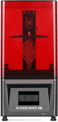
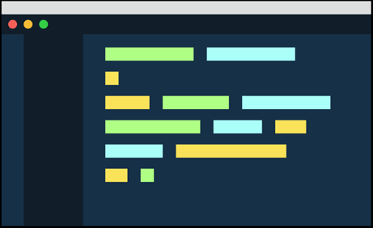

<!--

-->

#  Hi - I'm Evan :)

<table>
    <td style="width:50%">
        <body>
            
 I have a lot of hobbies. I like:

                <ul>
                    <li>Graphic Design💻🎨</li>
                    <li>Video Production🎞️</li>
                    <li>Photography📷</li>
                    <li>Sewwing and Leathercraft 🧵</li>
                    <li>3D Printing and Painting  </li>
                    <li>Drawing ✏️</li>
                </ul>
            
But I'm here because I love coding, too! I am:

            <ul>
                <li>A Full-Stack Web Developer in progress   </li>
                <li>Currently going through Coding Dojo  </li>
                <li>Looking to find a job in front-end web dev. where I can showcase my creative side 👔</li>
                <li>Capable and enjoy working with back-end just as much</li>
            </ul>           
            <h3>Background</h3>
            
I’ve worked with many different mediums, and I really love to learn. It is so rewarding to try something new and have it turn out well -  and even when it doesn’t, I can at least say that I’ve tried it!

I am a graduate of the University of Wisconsin Stevens Point, with a bachelors of science degree in Education.

When I am not working on projects, I am thanking God for everything He has given me 🙏, living life with my wife and kids, and/or playing video games 🖥️🎮.

             
            
📧 Reach me at wiorek.evan@gmail.com

<td style="width:50%">
            

             
            <a href="https://github.com/EvanWiorek/EvanWiorek/tree/main/FunKeySThemes" align="center">
FunKey S Themes
</a>
             
            <a href="https://www.evanwiorek.com">
Watch Faces
</a>
             
            <a href="https://github.com/EvanWiorek/Bootcamp-Projects/tree/main/Games">
Games
</a>
            

    </td>
</body>
</table>

<h2>Proficient In</h2>

&nbsp;&nbsp;
<!-- need to add javascript, python, GIT, terminal,
APIS
AJAX
CSS
Bootstrap
jQuery-->

<h2>Toolbelt</h2>

&nbsp;&nbsp;&nbsp;&nbsp;
<table>
    <td style="width:50%">
  <h5 align="center"><i>“He said to them, “Why are you afraid, you men of little faith?” Then He got up and rebuked the winds and the sea, and it became perfectly calm.” </i> </h5>
        <h6 align="center">Matthew 8:26</h6>
        

        <h5 align="center"><i>“I can do all things through Him who strengthens me.”</i></h5>

  <h6 align="center">Philippians 4:13</h6>
    </td>
    </table>

